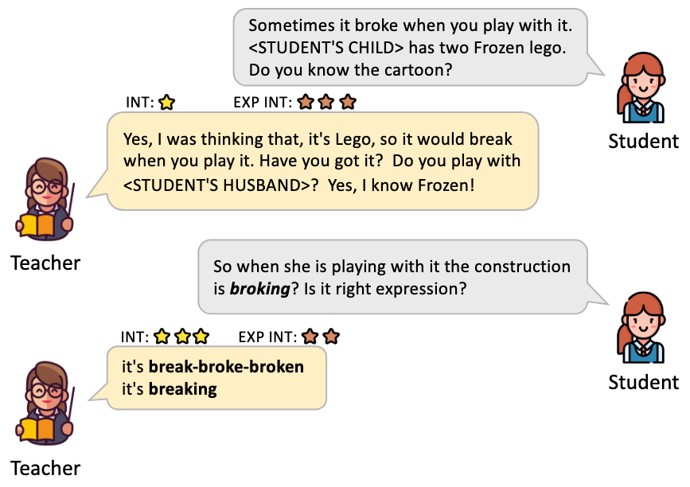

  

    【 📦 <a href="https://huggingface.co/collections/XingweiT/intrex-68a8f2c97688157066860ae2">IntrEx Datasets</a> 】

# IntrEx
IntrEx: A Dataset for Modeling Engagement in Educational Conversations. IntrEx is the first large-scale dataset annotated for interestingness and expected interestingness in teacher-student interactions.

# IntrEx: A Dataset for Modeling Engagement in Educational Conversations
- IntrEx is accepted by EMNLP 2025! 🎉
- This is the official repository of the IntrEx dataset. This site stores the experimental code the metadata of IntrEx (i.e., annotator ids and demographics). For the annotations, please visit our Huggingface.

## TL;DR 

IntrEx is the first large-scale dataset annotated for interestingness and expected interestingness in teacher-student interactions.

## Files

* data
  - `demographics.csv`                        shows the information of the corresponding annotator ID 
  - `sequence_level_annotator_ids.csv`        shows the first, second, third annotator of the corresponding project
  - `turn_level_annotator_ids.csv`            shows the first, second, third annotator of the corresponding project
